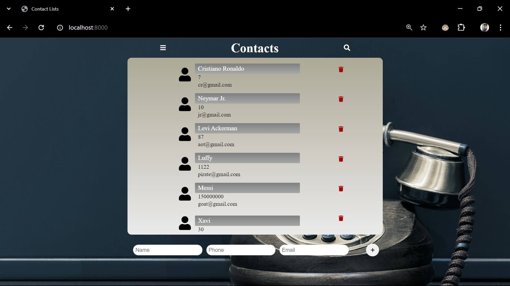

# Contacts

## Project Description: 
This project is a straightforward contact list application built using Node.js, Express, EJS, and MongoDB. It allows users to create and store contact information, focusing on simplicity and ease of use.





### `Features`:
1. Create Contacts: Users can add new contacts to the list, ensuring important contact information is saved for future reference.
2. Simple User Interface: The application uses EJS templates to render a clean and easy-to-navigate interface.
3. Data Storage: Contacts are stored in a MongoDB database, ensuring they persist across sessions.
4. Contact Information: Each contact must include a name and phone number, while providing an email address is optional.

### `Technologies used`: 
Node.js, Express, EJS, MongoDB

### `Technical Requirements`:
Node.js: v14.x or higher
Express: v4.x or higher
MongoDB: v4.x or higher
EJS: v3.x or higher

### Installation and Setup Instructions
Follow these steps to set up and run the project locally:

1. **Clone the repository:**
   Clone the repository to your local machine by running the following command in your terminal:
   ```sh
   git clone https://github.com/your-username/your-project.git
2. Install any neccessary dependencies.
3. Run the project locally using npm start.


## Available Scripts
In the project directory, you can run:

### `npm start`

Runs the app in the development mode.\
Open [http://localhost:8000](http://localhost:8000) to view it in your browser.
